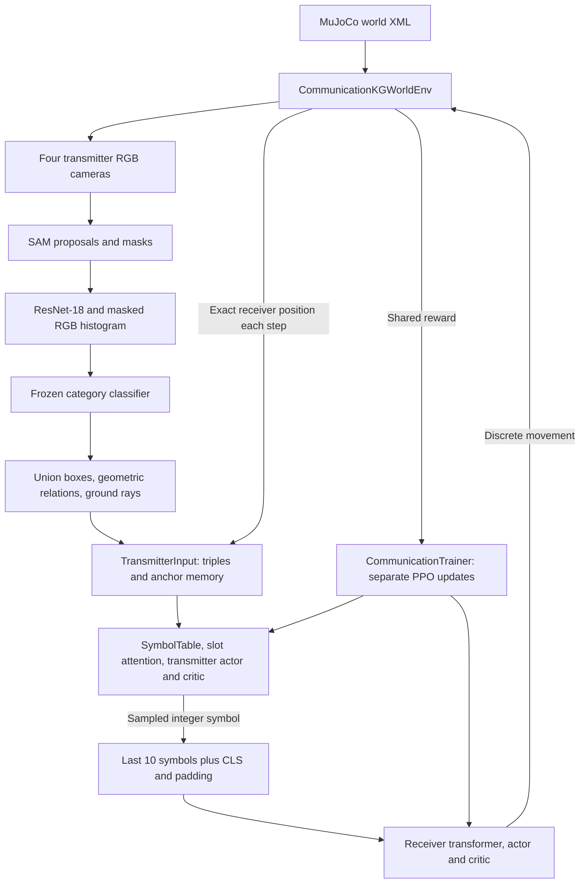

# Current architecture and project state

**Implementation update (2026-09-12):** A DIAL-inspired PPO path is now available alongside the independent baseline. See [DIAL.md](DIAL.md) for the new channel, trainer, evaluation tools, and validation status. The assessment below records the pre-DIAL snapshot; statements that DIAL is unimplemented or communication requires external `CORE` imports have been superseded. Other legacy entry points retain their original imports.

Snapshot: 2026-09-12. This assessment is restricted to `troy_dev_ppo_communication` and its descendants. Source code, XML, JSON summaries, training metrics, and existing documentation were inspected. No sibling directories or external dependencies were inspected. All 23 Python source files passed syntax parsing; training, rendering, imports, and binary checkpoint compatibility were not exercised. Saved results describe previous executions, not a fresh validation of the current environment.

## 1. Project state

This is a Python research prototype for learning control from visually grounded symbols, now extended to two-agent communication. It contains an implemented single-agent PPO baseline, a supervised proposal classifier, simulator-based perception diagnostics, and an implemented two-agent PPO training loop. Execution is through scripts; there is no service, API server, or deployment layer in this directory.

The current communication experiment has an immobile **transmitter** that sees the arena and emits one discrete symbol per step. A blind **receiver** reads a short symbol history and moves. Both learn from the same task reward, with separate PPO optimizers and critics. There is no differentiable path across the channel.

The saved 450-iteration communication run did not demonstrate successful communication. [RESULTS.md](RESULTS.md) proposes a differentiable channel using straight-through Gumbel-softmax as the next experiment; that proposal is **not implemented** in the source here. The negative result is evidence about the recorded configuration and seed, not proof that independent PPO can never learn this task.

The strongest single-agent result reported in `RESULTS.md` is 0.925 held-out food success and zero loose-lion deaths after 600 iterations using supervised category identity, slot attention, and normalized value loss. It is a historical, single-seed result. Its held-out evaluation was not rerun for this assessment, and older checkpoints should not be assumed compatible with the expanded current vocabulary.

## 2. System map

This is an in-process pipeline. The graph is a tensor-backed concept vocabulary and relation store, not a graph database or a message-passing graph neural network. PPO consumes triples assembled from current perceptions and remembered object positions; it does not traverse the saved graph edges.

| Location | Responsibility |
|---|---|
| [assets/kg_world.xml](assets/kg_world.xml) | Arena geometry, bodies, colors, cameras, and base physics actuators. |
| [lib/KGWorldEnv.py](lib/KGWorldEnv.py) | Gymnasium environments, layout sampling, rewards, RGB/segmentation rendering, and ground projection. |
| [lib/Perception.py](lib/Perception.py) | SAM proposals, visual features, concept box unions, and image-space relations. |
| [lib/SymbolicKG.py](lib/SymbolicKG.py) | Concept matching/discovery, symbols, relation counts, consolidation, and serialization. |
| [lib/Grounding.py](lib/Grounding.py) | Perception adapters, ranked triples, static anchor memory, and egocentric offsets. |
| [lib/OracleGrounding.py](lib/OracleGrounding.py) | Fixed body-to-node vocabulary, supervised-category adapter, and segmentation-based ablations. |
| [lib/SymbolPolicy.py](lib/SymbolPolicy.py) | Shared symbol encoder and slot attention with separate actor/critic MLP heads. |
| [lib/ReceiverPolicy.py](lib/ReceiverPolicy.py) | Discrete message vocabulary, sliding context, and receiver transformer. |
| [lib/CommunicationTrainer.py](lib/CommunicationTrainer.py) | Shared transmitter input construction and two-agent rollout/PPO implementation. |
| [lib/PPOTrainer.py](lib/PPOTrainer.py) | Single-agent rollout/PPO implementation. |
| [lib/ObjectCategories.py](lib/ObjectCategories.py), [lib/CategoryModel.py](lib/CategoryModel.py), [lib/CategoryData.py](lib/CategoryData.py) | Category schema, supervised head, dataset labels/splits, and classification metrics. |
| [lib/Oracle.py](lib/Oracle.py) | Segmentation-grounded diagnostics for proposals and KG identity, including fragmentation/confusion analysis. |
| [lib/Diagnostics.py](lib/Diagnostics.py), [lib/VideoRecorder.py](lib/VideoRecorder.py) | Run directories, metrics, reports, plots, and annotated rollout videos. |
| `scripts/` | Six executable workflows described below. |
| `models/`, `output/` | SAM weights, category data/model, logs, evaluation images, and saved training runs. |

## 3. World, observations, and task

`KGWorldEnv` provides the base continuous-control environment: three velocity controls and a 13-value observation, expanded to 17 with optional resources. The active PPO scripts use its kinematic subclasses instead.

`KinematicKGWorldEnv` moves the camera-bearing agent by directly changing positions and calling `mj_forward`; it does not step physics. Actions are 0 forward, 1 backward, 2 left, and 3 right, with a default step of one world unit and clipping to arena coordinates ±7. Yaw is randomized at reset and remains fixed. The policy receives only `[x/8, y/8, cos(yaw), sin(yaw)]`; object information enters through grounding.

`CommunicationKGWorldEnv` leaves that agent stationary and moves the separate `receiver` body instead. The receiver has an independently sampled, fixed yaw defining its movement axes. Neither its yaw nor its position is directly supplied to the receiver policy. The transmitter observation remains its own four-value pose, constant within an episode. Receiver position is separately supplied to transmitter grounding by `receiver_anchor()` in normalized world coordinates; receiver yaw is not part of that slot.

Four cameras (`cam_front`, `cam_left`, `cam_back`, `cam_right`) render 512×512 RGB frames by default. The XML also defines the lion, cage, food, receiver, water, and poison. The receiver exists as a stationary visual object in the base/single-agent world, and becomes mobile in the communication subclass. XML comments calling it permanently stationary predate that subclass.

Layouts change at reset. The lion is caged with default probability 0.5; a loose lion is also stationary but dangerous on proximity. There is an optional conflict layout that places food near the lion. The reward code checks loose-lion contact before food, so food within a loose lion's catch region is a trap. The current scripts default to no conflict layout.

| Event | Reward/behavior |
|---|---|
| Every step | −0.01 plus `0.5 * (previous_resource_distance - current_resource_distance)`. |
| Loose lion within 0.8 units | −50 and termination, checked first. |
| Food within 0.8 units | +10 and termination. |
| Water within 0.8 units, if enabled | +6 and termination. |
| Poison within 0.8 units, if enabled | −20 and termination. |
| 300 steps | Episode truncation. |

In communication, all outcome distances and shaping refer to the receiver. With `resources=0`, water and poison are parked below the floor; shaping targets food. With `resources=1`, shaping targets the nearer of food and water. Contact is implemented through endpoint distance checks, not simulated collision dynamics. The shaping expression above is the implemented formula; it does not include PPO's discount factor.

## 4. Perception and knowledge representation

### Visual front end

`PerceptionPipeline` uses SAM ViT-B from `models/sam_vit_b_01ec64.pth`. Its automatic mask generator uses 16 points per side, predicted IoU threshold 0.86, stability threshold 0.90, and minimum mask region area 64. Bounding-box area filtering accepts fractions from 0.0005 to 0.35 of the frame. Grounding can skip low-saturation frames before invoking SAM.

Each accepted proposal produces a **576-dimensional** embedding:

- 512 L2-normalized features from frozen ImageNet ResNet-18, using a padded crop resized to 224×224.
- 64 L2-normalized RGB histogram features, using four bins per channel over the proposal mask.
- Each component is multiplied by `sqrt(0.5)` before concatenation.

Some `SymbolicKG` comments still say 512; the actual `EMBEDDING_DIM` is 576. `detect()` returns `(boxes, embeddings, masks)`, while `detect_full()` returns `(boxes, masks, embeddings, quality)`; callers must respect the different order.

### Identity routes

The single-agent script exposes four routes through a common geometry/triple interface:

| `perception` | Proposal source | Identity source |
|---|---|---|
| `sam` | SAM | Cosine match against a previously built KG, default threshold 0.50. |
| `softcat` | SAM | Frozen supervised category head; reject background, unavailable categories, and confidence below 0.45. |
| `oracle_id` | SAM | MuJoCo segmentation labels for proposal identity. |
| `oracle_full` | Visible-body segmentation boxes | MuJoCo body identity; SAM is not instantiated. |

Communication currently hardwires `softcat`. Despite the name, downstream identity is a **hard argmax category**, not a probability vector. Maximum class probability becomes the confidence used for ranking triples.

The classifier is `LayerNorm(576) → Linear(576,128) → GELU → Dropout(0.1) → Linear(128,7)`. It is loaded in evaluation mode and frozen during PPO.

Category IDs are food=0, lion=1, cage=2, water=3, poison=4, receiver=5, background=6. Category IDs and KG node IDs are distinct: the default fixed KG orders bodies as food, lion, cage, receiver, so receiver's node ID is 3. With resources enabled, water and poison are appended. `build_oracle_kg()` creates one node per body using orthogonal placeholder visual embeddings and random four-dimensional symbols. The placeholders are not used for visual matching in these routes.

The older discovery path is still implemented in `SymbolicKG`: match above a cosine threshold or create a concept, update matched embeddings by normalized EMA with alpha 0.1, count observed edges, then optionally consolidate similar nodes and prune low-support nodes. Its phase-one executable is absent from this directory.

### Relations and localization

Detections with the same concept ID are merged into a union box within each camera. `inside` requires at least 70% coverage of the smaller candidate's box and an area at most 75% of the containing box. Otherwise, `near` is emitted when box centers are less than 30% of image width apart; it is represented once with the lower node ID first.

All four routes retain these image-space heuristics. Even `oracle_full` does not provide perfect physical relations or exact object-center coordinates. Object positions are estimated by projecting each union box's bottom-center ray onto the floor, clamped to a 20-unit range, and dividing by 8. The camera with the largest box provides each concept's chosen offset.

`assemble_triples_geo()` deduplicates relations across cameras, prioritizes them by mean endpoint confidence, and uses remaining slots for lone concepts `(node, PAD, PAD)`. It sorts the selected entries and pads to K, using `PAD=-1`. Relations can consume the entire budget before lone concepts are considered.

`AnchorMemory` turns measured offsets into normalized world positions, remembers static concepts for the episode, and fills free slots with remembered unary concepts. It does not preserve an independent history of relation triples. Each step, `deltas_from_anchors()` subtracts the current agent position and rotates offsets into forward/left coordinates. Static anchors remain estimates: immobility prevents motion staleness but does not remove initial projection or detection error.

## 5. Policies and the channel

### Transmitter and single-agent policy

`TripleActorCritic` uses a trainable `SymbolTable`: four-dimensional node symbols, four-dimensional relation symbols, a 3×4 source/relation/destination positional table, and a shared linear 2→4 distance gate. Node tokens are `(symbol + positional_embedding) * distance_gate(offset)`; relation tokens have no distance gate. Padding is zeroed. The gate starts with zero weights and unit bias.

Each triple becomes 12 values. Learned slot queries cross-attend to valid triples through key/value projections. This is one cross-attention pooling operation, not an iterative slot-refinement algorithm. The pooled slots are concatenated with the four-value pose. Separate actor and critic heads each use `Linear → Tanh → Linear`, with hidden width 38, sharing both the symbol table and attention module.

Single-agent defaults use six input triples and six output attention slots: 76 features, four movement logits, and one value. Communication uses six perception entries plus a seventh reserved **input** entry `(receiver_node, PAD, PAD)`: seven output attention slots, 88 features, four message logits, and one value. Attention can mix the receiver entry across its learned output slots; the reserved input position is not a hard-wired output feature block.

`TransmitterInput` removes receiver detections and all relations touching the receiver from SAM output. It appends the reserved receiver entry and refreshes its source anchor from the simulator every step. Trainer and video recorder use the same factory and class to build these inputs.

### Receiver

The current message vocabulary is `a,b,c,d`, integer IDs 0–3. `CLS_ID=4`, `NULL_ID=5`, and the embedding vocabulary has six entries. The message symbols are separate from the transmitter's internal node/relation symbols; no embedding table is shared across agents.

The actual model input is **11 integer token IDs**, laid out `[CLS, oldest retained symbol, ..., newest symbol, NULL padding]`. At most ten messages are retained in the input. Embedding expands this to 11×4 values, with learned positional embeddings. Three transformer encoder blocks use model width 4, one attention head, feed-forward width 16, and zero dropout. NULL keys are masked. The contextualized CLS vector feeds separate actor/critic MLPs of hidden width 4. The default receiver has 865 parameters.

No images, environment observation, explicit reward, past actions, or coordinates are included in the receiver forward input. There is no recurrent hidden state carried between forward calls; memory is the retained message window. The trainer keeps the full episode message list, while `build_context()` slices its most recent ten entries.

The channel is a sampled integer produced under `no_grad`, then embedded by the receiver. Receiver losses cannot backpropagate to transmitter logits. This is the independent-learning/RIAL-style baseline described in `RESULTS.md`, not DIAL.

## 6. Rollout and optimization lifecycle

At episode reset, the environment samples a layout, transmitter anchor memory and message history are cleared, and a perception pass populates the static scene. Communication defaults to one pass per episode. If `perceive_passes` is increased, additional passes occur over the first few action steps, not all synchronously at reset. No regular 75-step refresh is used in communication; that cadence belongs to the single-agent trainer.

Each communication step:

1. Refresh the reserved receiver position and derive transmitter-frame offsets.
2. Sample a transmitter symbol and append it to message history.
3. Build the updated receiver context and sample its movement action.
4. Step the receiver in the environment and store the common reward and done flag.
5. Reset on termination/truncation, or continue the current episode across rollout boundaries.

The rollout stores transmitter pose/triples/deltas/messages/log probabilities/values, receiver contexts/actions/log probabilities/values, and shared rewards/dones. Each critic supplies its own GAE estimates and return targets. Separate Adam optimizers update the transmitter and receiver sequentially; the receiver update uses recorded contexts rather than resampling messages.

| Setting | Communication default |
|---|---|
| Iterations / horizon | 450 / 2,048 environment steps |
| Learning rate | 0.0003 for each optimizer |
| Discount / GAE lambda | 0.99 / 0.95 |
| PPO clipping | 0.2 |
| Epochs / minibatch | 10 / 256 |
| Entropy / value coefficients | 0.01 / 0.5 |
| Gradient norm limit | 0.5 |
| Value loss normalization | Enabled |
| Seed / device | 0 / CUDA |
| Checkpoint interval / videos | 25 iterations / 10 videos |

Advantages are standardized. With value normalization enabled, the critic loss is `mean(((V - return) / (std(return) + 1e-8))**2)`; critics still predict raw returns. The single-agent script also enables this by default, although the `PPOTrainer` class constructor alone defaults to false.

Two implementation details matter for future training changes: both trainers treat truncation as terminal for GAE, and communication bootstraps the receiver critic from the existing message history at a horizon boundary, before a new transmitter message is appended. These are current behaviors, not experimentally validated design recommendations.

## 7. Workflows and saved artifacts

Scripts accept `key=value` arguments. Defaults are defined in each script.

| Script | Workflow |
|---|---|
| [download_sam_checkpoint.py](scripts/download_sam_checkpoint.py) | Fetch the SAM checkpoint used by the perception pipeline. |
| [generate_category_dataset.py](scripts/generate_category_dataset.py) | Render scenes, run frozen proposal features, label masks from simulator category images, and save embeddings, labels, frame groups, metadata, proposal diagnostics, and example images. |
| [train_category_model.py](scripts/train_category_model.py) | Fit the category head with inverse-frequency weighted cross-entropy and AdamW; save the best validation macro-F1 checkpoint and epoch history. Defaults: 30 epochs, batch 256, learning rate 0.001. |
| [evaluate_category_model.py](scripts/evaluate_category_model.py) | Evaluate the stored split and optional newly seeded scenes; write metrics, confusion matrix, fragmentation statistics, and prediction images. |
| [train_ppo.py](scripts/train_ppo.py) | Train the single-agent slot policy with one of four perception routes. Defaults: 150 iterations, six triples, perception every 75 steps, `perception=sam`. |
| [train_communication.py](scripts/train_communication.py) | Assemble the soft-category transmitter and blind receiver, train both, and record communication diagnostics. |

The category dataset split groups **frames**, not entire scenes: proposals from the same image stay together, but related views of a scene can cross splits. Live evaluation uses separate scene seeds. Category checkpoints carry class names, dimensions, state dictionary, epoch, and metrics; loading rejects the older six-class schema.

PPO invocations create timestamped run directories. Communication saves `kg_init.pt`, periodic `checkpoints/iterNNNN_{transmitter,receiver}.pt`, `transmitter_final.pt`, `receiver_final.pt`, and `kg_trained.pt`, plus `metrics.jsonl`, `report.txt`, plots, and videos. The trained KG copies learned node/relation symbols back from the transmitter; full policy checkpoints additionally contain the distance gate, positional embeddings, attention, and heads.

Single-agent runs save analogous `policy_final.pt` and `policy_iterNNNN.pt` files, plus symbol history/evolution artifacts. Warm starts restore model weights only: single-agent `init_from` is a policy file, communication `init_from` is a directory containing both `*_final.pt` files. Optimizers, simulator/RNG state, and partial episodes are not restored, so this is not exact training resumption.

Communication videos are recorded after iterations beginning equal run segments: 1, 46, 91, …, 406 at defaults. Recording consumes the same environment, and the script forces a trainer reset afterward. Video settings therefore affect subsequent RNG consumption and episode boundaries. These recordings are inspection rollouts, not an independent held-out communication evaluation.

## 8. Evidence in the current directory

The stored dataset summary records 3,967 proposals over 1,600 frame groups. Counts are food 225, lion 752, cage 1,703, receiver 965, and background 322; water and poison have no examples. Proposal recall is food 0.397, lion 0.495, cage 0.915, and receiver 0.523. This measures detection availability, separately from classifier accuracy. Source: [category dataset summary](output/category_dataset.pt.summary.json).

The saved [category evaluation](output/category_evaluation/metrics.json) reports accuracy and macro-F1 of 1.0 on both the stored split and live holdout, with checkpoint epoch 3. Zero-support classes are excluded from macro-F1. This does not validate water/poison classification. `RESULTS.md` also notes that distinct object colors make classification unusually easy; perfect classification does not imply high proposal recall or general visual recognition.

Seven run directories contain metrics: four single-agent runs (40, 200, 300, and 300 local iterations) and three communication runs (10, 10, and 450). The second 300-iteration single-agent run is named as a continuation to 600 total iterations, but its metric iteration counter restarts at one.

For [the 450-iteration communication run](output/runs/comm_20260829_205854_comm450_s0/metrics.jsonl), direct aggregation confirms 4,712 completed episodes and mean receiver explained variance of 0.00007033. Window values below are arithmetic means of per-iteration metrics, not episode-weighted estimates:

| Metric | First 50 iterations | Last 50 iterations |
|---|---:|---:|
| Food rate | 0.3505 | 0.4326 |
| Mean return | −5.0674 | −4.3404 |
| Receiver entropy | 1.3697 | 1.3709 |
| Receiver explained variance | 0.000140 | −0.000342 |
| Transmitter explained variance | 0.1839 | 0.3651 |

Receiver entropy remains close to `ln(4)=1.3863`, while its critic explains essentially none of the return variance. These measurements support the recorded failure to establish useful communication. Entropy alone does not mathematically prove an unchanged policy, and the rising food rate alone does not establish learned communication. The transmitter critic's improvement indicates that its inputs became useful for return prediction, without establishing a useful message code.

## 9. Reproducibility gaps and outstanding work

- **External runtime coupling:** scripts read `os.environ['CORE']` and import `lib.python.Logger` and `lib.python.ArgumentParser`. Those imported modules are absent from this subtree. Local `lib/Logger.py` and `lib/ArgumentParser.py` do not satisfy the `lib.python.*` paths; the latter also depends on `CORE`. The external implementation and availability were deliberately not inspected.
- **Dependencies are not pinned here:** imports require PyTorch, torchvision, Segment Anything, MuJoCo, Gymnasium, NumPy, OpenCV, and Matplotlib. Rendering scripts default `MUJOCO_GL` to EGL and training defaults to CUDA. ResNet weights may require an existing cache or download. No dependency manifest, lockfile, test suite, or CI configuration was found in the inspected directory.
- **Default single-agent startup lacks its KG:** `perception=sam kg=latest` searches `output/runs/kg_*/kg.pt` or `output/kg.pt`. No `kg.pt` exists here. Saved `kg_init.pt`/`kg_trained.pt` files do not satisfy this lookup. The soft-category and oracle routes build their own fixed vocabulary instead.
- **Historical source is missing:** `RESULTS.md` references phase-one/experiment scripts and a single-agent `TransformerPolicy.py` not present as source here. Cached bytecode bearing old names is not current source. The only accepted single-agent architecture is `model=slot`; the current receiver transformer is a different model.
- **Comments lag code:** ten-symbol channel descriptions and old CLS/NULL numeric comments remain, despite the current four-symbol constants. Some geometry/graph comments overstate exactness. The executable behavior and dimensions documented above take precedence.
- **Communication plots are incomplete:** `save_training_curves()` looks for unprefixed `pi_loss`, `entropy`, and related keys, while communication records `tx_*` and `rx_*`. Its loss panels therefore have no series for communication rows. JSONL contains the actual per-agent statistics; task-progress curves still work.
- **Resource metrics are incomplete:** the environment supports water/poison terminal outcomes, but communication's outcome counters specialize in food/lion/timeouts. Resource events are not separately summarized, and the current stored category data does not train those classes.
- **Generalization remains open:** results are single-seed; current perception still misses objects and uses 2D relation heuristics. Receiver localization is oracle-fed. Fixed one-node-per-category unions assume one instance per category. Older single-agent results predate some receiver/vocabulary changes, so exact replay requires matching model shapes and vocabulary.
- **Next communication method remains a proposal:** implementing a differentiable channel would require changing channel representation and gradient/optimizer handling, not just reducing vocabulary size. There is no Gumbel-softmax/DIAL implementation or separate communication evaluation executable here.

This document describes the current implementation and available evidence. It does not claim that the dependency setup, historical checkpoints, or proposed next experiment have been validated by execution.
